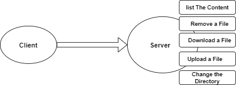
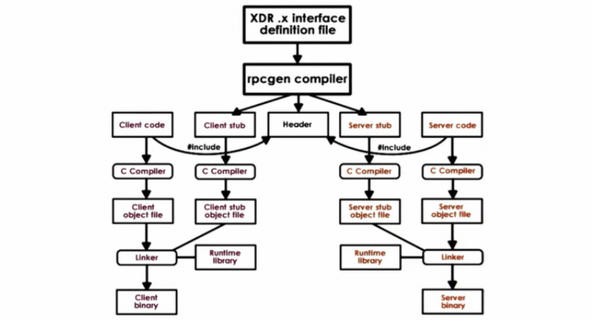

# Simple FTP Server Using Remote Procedure Call (RPC) In Linux .

This Repository Contains a Simple FTP Server Using Remote Procedure Call In Linux , This FTP Server Can perform this Operations :

<div align="center" >

</div>

To Implement RPC i used a template generated by rpcgen Tool in Linux .

To Generate a template Using Rpcgen you need to Write The XDR File which specifies all The Functions and structures In The Program.

**rpcgen is a tool that generates C code to implement an RPC protocol.  The input to rpcgen is a language similar to C known as RPC Language  (Remote Procedure Call Language).**

**rpcgen  is normally used as in the first synopsis where it takes an input file and generates up to four output  files.   If  the  infile  is  named proto.x, then rpcgen will generate a header file in proto.h, XDR routines in proto_xdr.c, server-side stubs in proto_svc.c, and  client-side  stubs in  proto_clnt.c.**

The XDR File Should Have A format Lie This :

```c
/// Here You Need to Define All The Structures you will Use In The Program .

program Programe_Name
{
version Version_Name
{
	// List Of Functions 

    Outpout_Type Function_Name(Args) = Version ;

    // You can Send Only One Arguments , if you need to Send More define a struct contains The List of Arguments that you want to Send , and Use it as an Argument .

} = 1; // you can Use any Number You Want

}=0x20000001; // The Program Version should be i HexaDecimal 

```

The XDR File in our Case Looks Like This :

```c

struct data{
char buffer[25000];
int size;
};

typedef struct data data;

struct Path
{
char FileName[20];
};

typedef struct Path Path;

program FTPServerProgram
{
version version1
{
	int initialzeDownload(Path)=1;
	void initialzeUpload(Path)=2;
	data getFile()=3;
	void putFile(data)=4;	
	int changeDirectory(Path)=5;
	int listDirectory(Path)=6;	
	int removeFile(Path)=7;
}=1;

}=0x20000001;

```

To Generate The Template Use This Command :

```bash
rpcgen - a -C ftp.x
```

The Files Generated :

<div align="center" >

</div>

if you don't have rpcgen Installed in Your Machine , you can use this Command to install It :

```bash
sudo apt-get install rpcbind
```

**rpcgen** generate 7 Files :

* **MakeFile :** to compile The Project .
  
* **ftp.h :** Header File .

* **ftp_clnt.c :** Contains The Definition of all The Functions.

* **ftp_client.c :** in This File You can Call The Functions in The Server .

* **ftp_xdr.c :** XDR Configuration in The Server .

* **ftp_svc.c :** Contains The Definition of all The Functions.

* **ftp_server.c :** This File Contain The Implementation of all The Functions (basically it contains Empty Functions that you need to Implement ).


To Compile The Client , there is a MakeFile in The Client Folder .
```bash
make -f Makefile.ftp ftp_client
```
To Compile The Server , there is a MakeFile in The Client Folder .
```bash
make -f Makefile.ftp ftp_server
```

### The Functions Implemented in the Server :

```c
#include "ftp.h"
#include<sys/stat.h>
#include<sys/types.h>
#include<unistd.h>
#include<stdio.h>
#include<stdlib.h>
#include<string.h>

static FILE *file;
static int FileLenght,ByteSended=0,ByteReceived=0,output=0,SizeMax=25000;

int * initialzedownload_1_svc(Path *argp, struct svc_req *rqstp)
{
	static int  result = 1;
	struct stat st;
	memset(&st,'0',sizeof(st));
	if(stat(argp->FileName,&st) == -1)
	{
		result = 0; 
		return &result;
	}
	if((file = fopen(argp->FileName,"r")) == NULL)
	{
		fprintf(stderr,"Failed to open The File ...\n");
		exit(EXIT_FAILURE);
	}
	printf("Starting Transmission The File %s ...\n",argp->FileName);	
	fseek(file,0,SEEK_END);
	FileLenght = ftell(file);
	fseek(file,0,SEEK_SET);
	printf("The size of The File is %d \n",FileLenght);
	return &result;
}

void * initialzeupload_1_svc(Path *argp, struct svc_req *rqstp)
{
	static char * result;
	if((file = fopen(argp->FileName,"w+")) == NULL)
	{
		fprintf(stderr,"Failed to Create The File ... \n");
		exit(EXIT_FAILURE);
	}
	printf("Starting Receiving The File %s ...\n",argp->FileName);	
	return (void *) &result;
}

data * getfile_1_svc(void *argp, struct svc_req *rqstp)
{
	static data  result;
	if(file != NULL)
	{		
		if(FileLenght-ByteSended < SizeMax)
		{
			SizeMax = FileLenght-ByteSended;			
		}
		if((output = fread(result.buffer,1,SizeMax,file)) != SizeMax)
		{
			fprintf(stderr,"Failed to read from The File ...\n");
			exit(EXIT_FAILURE);
		}
		result.size = output;
		ByteSended += output;

		if(ByteSended == FileLenght)
		{
			fclose(file);
			ByteSended = 0;
			printf("File Sended Successfully ... \n");
			printf("bytes Sended : %d , bytes Received : %d ...\n",ByteSended,FileLenght);
			printf("End of Transsmition ... \n");
		}
	}
	return &result;
}

void * putfile_1_svc(data *argp, struct svc_req *rqstp)
{
	static char * result;
	if(file != NULL)
	{
		if((output = fwrite(argp->buffer,1,argp->size,file)) != SizeMax)
		{
			fprintf(stderr,"Failed to write from The File ...\n");
			exit(EXIT_FAILURE);
		}
		ByteReceived += output;
		if(output < SizeMax)
		{
			fclose(file);
			ByteReceived = 0;
			printf("File Received Successfully ... \n");
			printf("Total bytes Received : %d  ...\n",ByteReceived);
			printf("End of Transsmition ... \n");
		}
	}
	

	return (void *) &result;
}

int * changedirectory_1_svc(Path *argp, struct svc_req *rqstp)
{
	static int  result = 1;
	struct stat st;
	memset(&st,'0',sizeof(st));
	if(stat(argp->FileName,&st) == -1)
	{
		result = 0;
		return &result;
	}
	char command[30];
	sprintf(command,"cd %s",argp->FileName); 
	system(command);
	return &result;
}

int * listdirectory_1_svc(Path *argp, struct svc_req *rqstp)
{
	static int  result = 1;
	struct stat st;
	memset(&st,'0',sizeof(st));
	if(stat(argp->FileName,&st) == -1)
	{
		result = 0;
		return &result;
	}
	char command[30];
	sprintf(command,"ls %s",argp->FileName); 
	system(command);
	return &result;
}

int * removefile_1_svc(Path *argp, struct svc_req *rqstp)
{
	static int  result = 1;
	struct stat st;
	memset(&st,'0',sizeof(st));
	if(stat(argp->FileName,&st) == -1)
	{
		result = 0;
		return &result;
	}
	char command[30];
	sprintf(command,"rm  %s",argp->FileName); 
	system(command);
	
	return &result;
}
```

### Calling The Functions from The Client :

```c
#include "ftp.h"


void ftpserverprogram_1(char *host,int option,char FilePath[20])
{
	CLIENT *clnt;
	int  *result_1;
	Path  initialzedownload_1_arg;
	void  *result_2;
	Path  initialzeupload_1_arg;
	data  *result_3;
	char *getfile_1_arg;
	void  *result_4;
	data  putfile_1_arg;
	int  *result_5;
	Path  changedirectory_1_arg;
	int  *result_6;
	Path  listdirectory_1_arg;
	int  *result_7;
	Path  removefile_1_arg;
	int SizeMax=25000,FileLenght=0,bytesReceived=0,bytesSended=0,output=0;
	FILE *file = NULL;   
#ifndef	DEBUG
	clnt = clnt_create (host, FTPServerProgram, version1, "tcp");
	if (clnt == NULL) {
		clnt_pcreateerror (host);
		exit (1);
	}
    
#endif	/* DEBUG */
	switch (option)
	{
	case 1 :
				strcpy(initialzedownload_1_arg.FileName,FilePath);
				if(( file = fopen(initialzedownload_1_arg.FileName,"w+") ) == NULL)
				{
					fprintf(stderr,"Failed to create The File with The Name %s ...\n",initialzedownload_1_arg.FileName);
					return;
				}			
				result_1 = initialzedownload_1(&initialzedownload_1_arg, clnt);
				if(!*result_1)
				{
					printf("File Not Found ...\n");
					return;
				}
				while(1)
				{
					result_3 = getfile_1((void*)&getfile_1_arg, clnt);
                    if((output = fwrite(result_3->buffer,1,result_3->size,file)) == -1)
					{
						fprintf(stderr,"Failed to write in The File %s ...\n",FilePath);
						return;
					}
					printf("%d bytes Received ...\n",output);
					bytesReceived += output;
					if(output < SizeMax)
					{
						fclose(file);
						printf("Total Bytes Received is %d ... \n",bytesReceived);
						printf("File Received Successfully ... \n");
						return;
					}
				}					
	break;

    case 2 :
                strcpy(initialzeupload_1_arg.FileName,FilePath);
                result_2 = initialzeupload_1(&initialzeupload_1_arg, clnt);
                if((file = fopen(FilePath,"r")) == NULL)
                {
                    fprintf(stderr,"Failed to Open The File %s ... \n",initialzeupload_1_arg.FileName);
                    return;
                }
                fseek(file,0,SEEK_END);
                FileLenght = ftell(file);
                fseek(file,0,SEEK_SET);
                printf("File Lenght = %d , File Name = %s \n",FileLenght,FilePath);                
                while(1)
                {
                    if((output = fread(putfile_1_arg.buffer,1,SizeMax,file)) == -1)
                    {
                        fprintf(stderr,"Failed to Read from The File %s ... \n",initialzeupload_1_arg.FileName);
                        return;
                    }
                    putfile_1_arg.size = output;
                    bytesSended += output;
                    result_4 = putfile_1(&putfile_1_arg, clnt);

                    if(bytesSended == FileLenght)
                    {
                        fclose(file);
                        printf("File Sended Successfully ... \n");
                        printf("bytes Sended : %d , File Lenght : %d \n",bytesSended,FileLenght);
                        printf("End of Transsmition ... \n");
                        return;
                    }
                }
                
    break;
    case 3 :
                strcpy(listdirectory_1_arg.FileName,FilePath);
                result_6 = listdirectory_1(&listdirectory_1_arg, clnt);
                if(!*result_6)
                {
                    fprintf(stderr,"Directory Not found ... \n");
                    return;
                }
    break;

    case 4 :
                strcpy(changedirectory_1_arg.FileName,FilePath);
                result_5 = changedirectory_1(&changedirectory_1_arg, clnt);
                if(!*result_5)
                {
                    fprintf(stderr,"Directory Not found ... \n");
                    return;
                }
    break;
    case 5 :
                strcpy(removefile_1_arg.FileName,FilePath);
                result_7 = removefile_1(&removefile_1_arg, clnt);
                if(!*result_7)
                {
                    fprintf(stderr,"Directory Not found ... \n");
                    return;
                }
    break;
}

	
#ifndef	DEBUG
	clnt_destroy (clnt);
#endif	 /* DEBUG */
}


int main (int argc, char **argv)
{
	if (argc < 2) {
		fprintf(stderr,"Not Enough Parameters ... \n");
		exit(EXIT_FAILURE);
	}	
	char *host;
	char FilePath[20];
	int option;
	host = argv[1];

	while(1)
	{
		printf("------------------------ Select One of The Available Options ------------------------ \n");
		printf("1 - Download a File from The Server ... \n");
		printf("2 - Upload a File to The Server ... \n");
		printf("3 - List The Content of The Server ... \n");
		printf("4 - Change The Directory inside The Server ... \n");
		printf("5 - Remove a File in The Server  ... \n");
		printf("6 - Quit ...");
		printf("----------------------------------------------------------------------------------------\n");
		printf("Enter Your Choise : ");
		scanf("%d",&option);
		
		switch (option)
		{
		case 1:		printf("Enter The Name of The File that you Want to Download   :  ");
					scanf("%s",FilePath);
					ftpserverprogram_1 (host,1,FilePath);                    
			break;
		case 2:		printf("Enter The Name of The File that you Want to Upload     :  ");
					scanf("%s",FilePath);
					ftpserverprogram_1 (host,2,FilePath);			
			break;
		case 3:		printf("Enter The Name of The Directory That You Want to list  :  ");
					scanf("%s",FilePath);
					ftpserverprogram_1 (host,3,FilePath);			
			break;
		case 4:		printf("Enter The Name of The Directory  :  ");
					scanf("%s",FilePath);
					ftpserverprogram_1 (host,4,FilePath);
			break;
		case 5:		printf("Enter The Name of The File That you Want to remove   :  ");
					scanf("%s",FilePath);
					ftpserverprogram_1 (host,5,FilePath);			
			break;
		case 6:
					printf("Good Bye See You The Next Time ... \n");
					exit(EXIT_SUCCESS);
			break;							
		default:	printf("Please Enter one of The Available Options  ... \n");					
			break;
		}
	}

	return 0;
}
```


